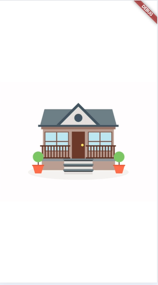
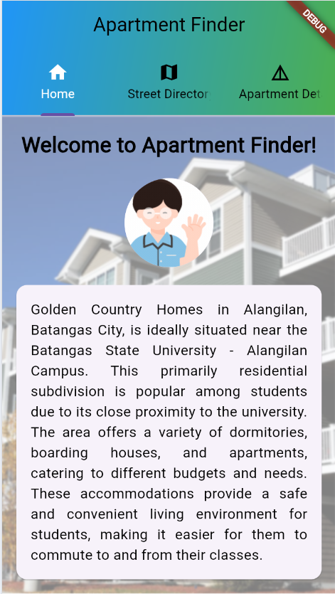
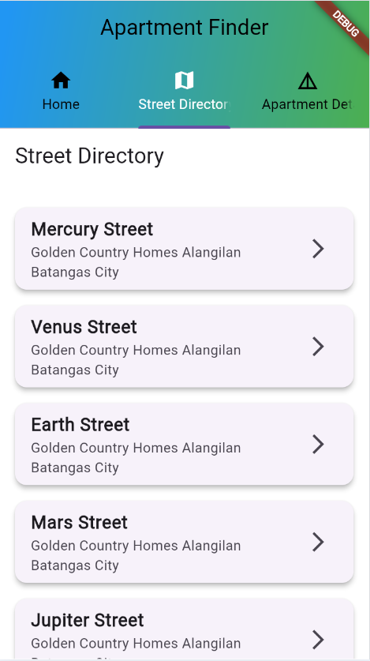
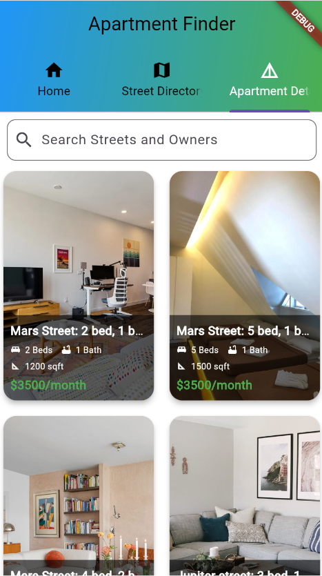

# apartment

This Splash Screen API lets apps launch with animation, including an intro-app motion at launch, a splash screen showing the app icon, and a transition.

It contains the introduction where it is used for the process of running the  application . It includes the details of the Golden Country Home that is used for performing this app. 

The street directory includes the listed streets that are inside of  GCH, this directory contains the details and address of each street in the apartment finder. It is also directed for the apartment details.

The Apartment details contains images, with details of each apartment that is in the street directory including (capacities, number of rooms, size of the apartment , and the price). In this tab, you can also search which street you would like to look at in finding an apartment you want.

## Getting Started

This project is a starting point for a Flutter application.

A few resources to get you started if this is your first Flutter project:

- [Lab: Write your first Flutter app](https://docs.flutter.dev/get-started/codelab)
- [Cookbook: Useful Flutter samples](https://docs.flutter.dev/cookbook)

For help getting started with Flutter development, view the
[online documentation](https://docs.flutter.dev/), which offers tutorials,
samples, guidance on mobile development, and a full API reference.
